## Oricon
Product authentication blockchain-app to register original products and verify them through QR codes build using Hyperledger Fabric, Express.js, and Ionic (Angular).

## Features
* QR Code Scanner
  * Scan QR codes containing registered unique ID for each product
* Wallet
  * Manage ORC tokens (ERC-20 compliant) needed to execute smart contract transactions
* Enrollment and Login
  * Let users import their own wallet and login to the app
* Admin Dashboard
  * Manage products (create, update, soft delete, and view updates history)
  * Show all users and register new users

## Demo
 

  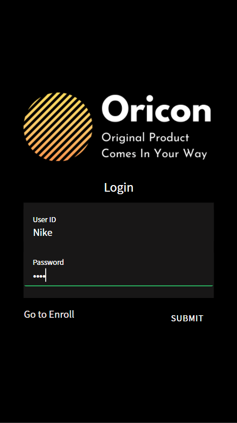
  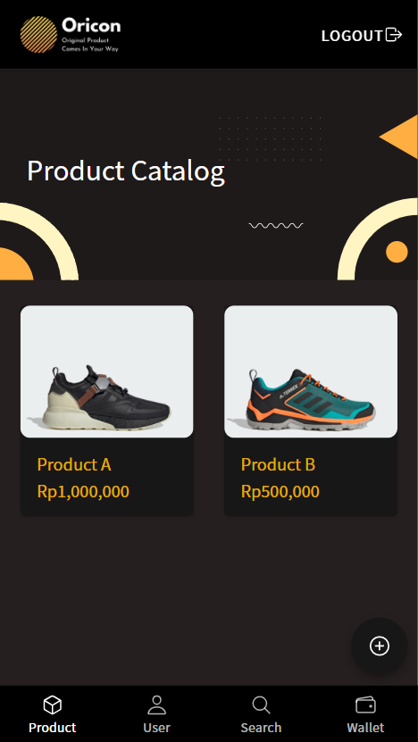
  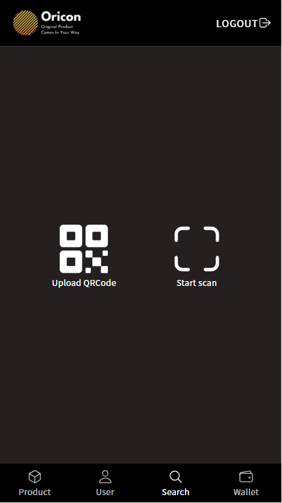

 

 

  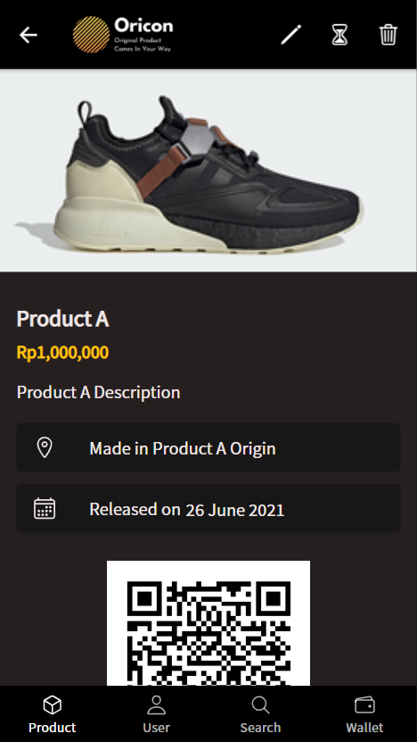
  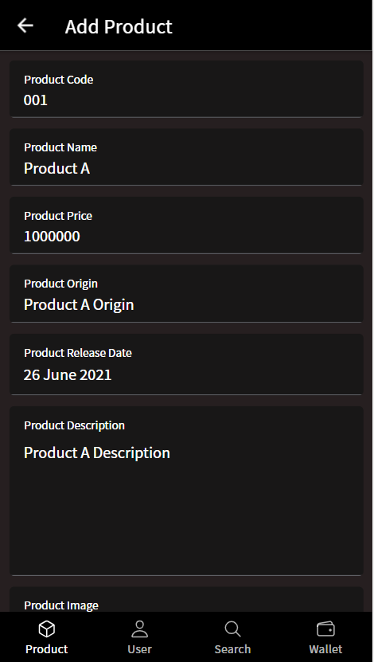
  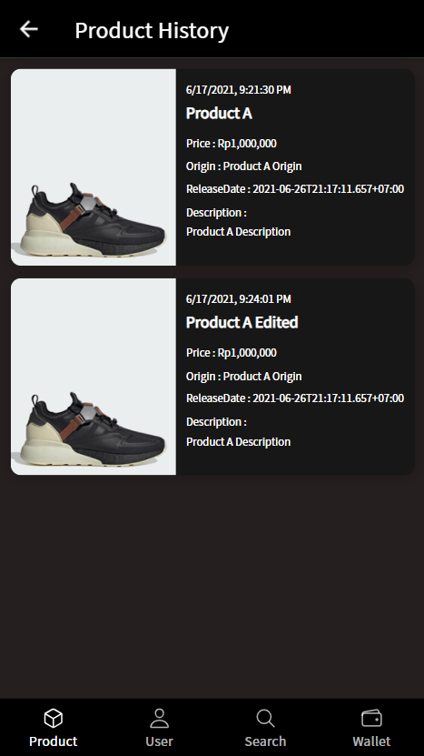

 

 

  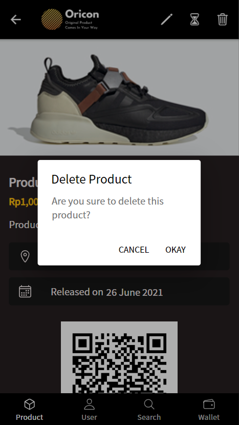
  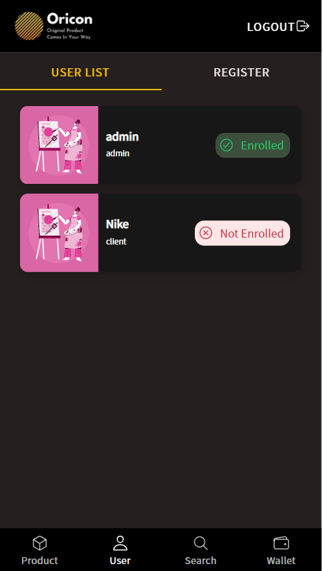
  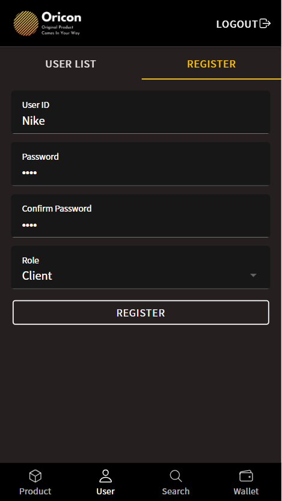

 

 

  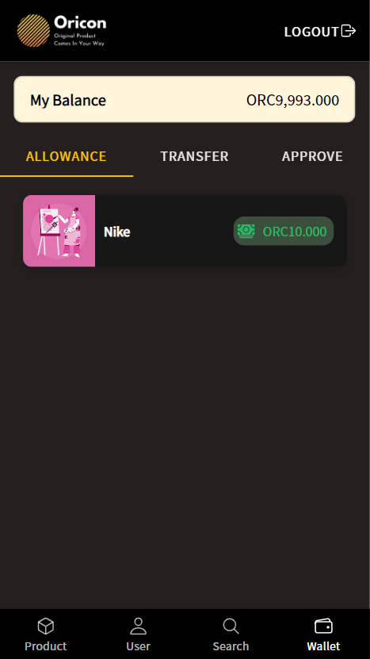
  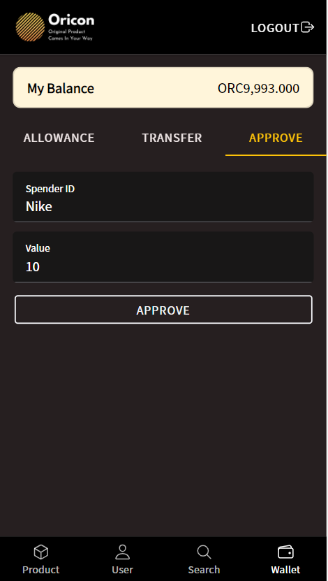
  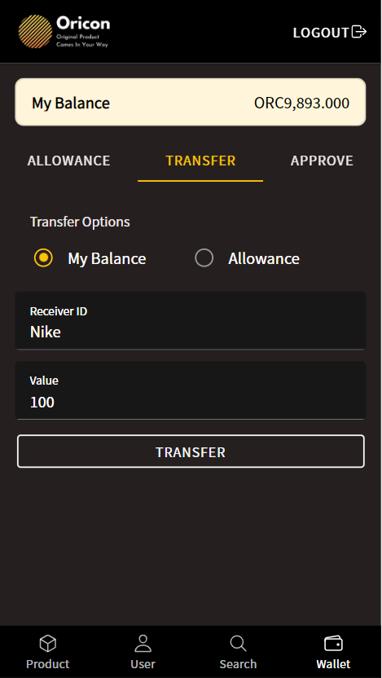

 
